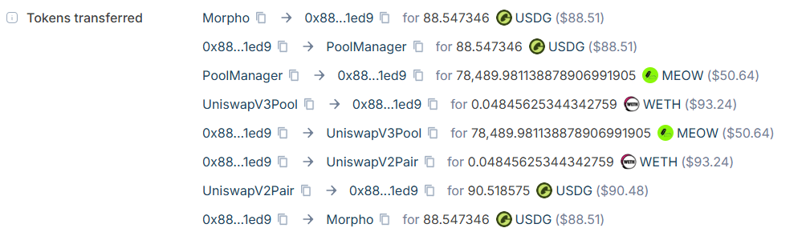

# robinarb

An atomic on-chain arbitrage bot for [Robinhood Chain](https://docs.robinhood.com/chain/) (chain id `4663`), targeting Nitro/Arbitrum-Orbit.

- Ingests pool state over RPC/WS from a self-hosted Nitro full node.
- Discovers pools across Uniswap v2/v3/v4, PancakeSwap v3, SushiSwap v3, SwapHood v3, Sheriff v2.
- Auto-probes every non-anchor token for fee-on-transfer/rebase behavior before routing through it (`ingest/fee_probe.rs`).
- Searches WETH/USDG-anchored cyclic routes, quotes them with exact AMM math, and fires atomic swaps through a deployed `ArbExecutor` contract, funded via a Morpho Blue flashloan when the contract doesn't already hold the capital.
- Submission runs on a dedicated, isolated sender thread (`executor/lanes.rs`) so a busy ingest pipeline never delays a live transaction.


## Example landed transaction



## Quick start

```bash
cp config.toml.example config.toml   # fill in RPC endpoints, then edit
cargo build --release
./target/release/robinarb check-config
./target/release/robinarb run         # paper mode until [execution] enabled = true
```

Managed in production via systemd:
```bash
systemctl {start|stop|restart|status} robinarb.service
```

## Repo layout

- `src/ingest/` — discovery, state hydration, fee-on-transfer probing, live RPC/WS ingest.
- `src/routing/` — route graph, evaluator, optimizer.
- `src/executor/` — tx encoding, isolated sender lane, nonce management.
- `contracts/src/ArbExecutor.sol` — the on-chain executor (Morpho flashloan + V2/V3/V4 swap execution).

## Disclaimer

This bot moves real funds and submits real, irreversible on-chain transactions. Gas is paid on every attempt whether it lands or reverts, and on-chain conditions (sequencer congestion, token behavior, competing bots) can and do change without notice. Nothing here is financial advice. Run it against capital you can afford to lose.

In live testing so far, accumulated gas from reverted attempts has outweighed profit from landed ones - net result is a small loss, not a small profit. Proof of concept, not a profitable strategy yet.
